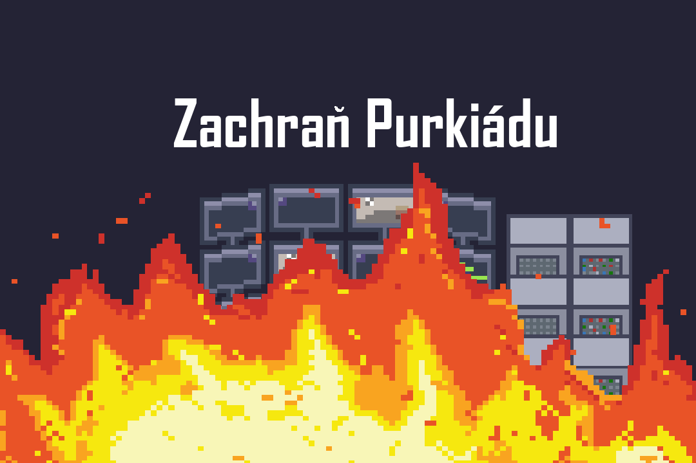

<p align="center">
  
</p>

<h1 align="center">Zachraň Purkiádu</h1>

<p align="center">
  <strong>A short 2D pixel art adventure game that combines logic puzzles with IT concepts</strong>
  <br />
  Built with Godot Engine and created for Purkiáda 2023
</p>

<hr />

## About

**Zachraň Purkiádu** (Save Purkiáda) is an immersive 2D logic game that takes players on an exciting journey through a school in crisis. Set in the year 2022, players must use their wit, logical thinking, and IT knowledge to save the annual Purkiáda event from catastrophe. Based on our experience with the previous year's competition, fixing major issues with the servers the evening before it.

## Gameplay

> _You wake up in your school on the day before Purkiáda 2022. Something's terribly wrong - the school is on fire, systems are failing, and chaos reigns. As the only one who can save the day, you must navigate through various challenges, solve complex puzzles, and restore the school's critical systems before it's too late._

### Your goals:

- **Explore** the school environment and uncover hidden clues
- **Solve** IT-themed logic puzzles to progress
- **Save** the Purkiáda event from total disaster

## Installation

### Requirements

- Godot Engine 3.x or higher
- Windows/Linux/macOS

### Quick Start

1. Clone this repository
   ```bash
   git clone https://github.com/theczechr/zachran-purkiadu.git
   ```
2. Open the project in Godot Engine
3. Press F5 to run the game

## Development

This educational game was created in 2 weeks in a team of 4 people specifically for **Purkiáda 2023** built using the Godot Engine.
